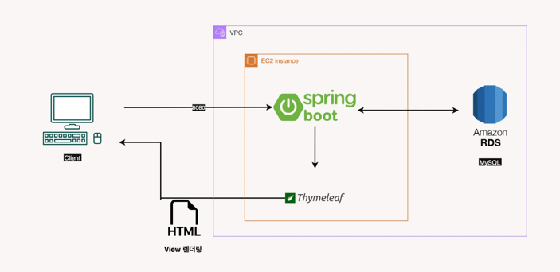
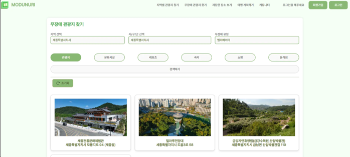
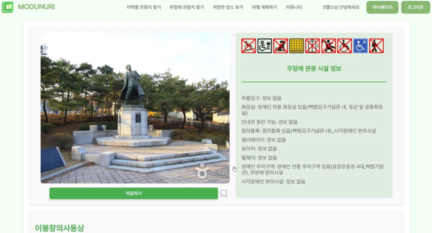
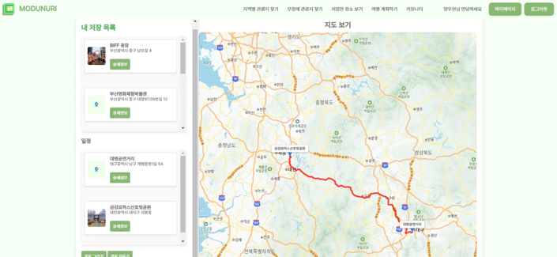
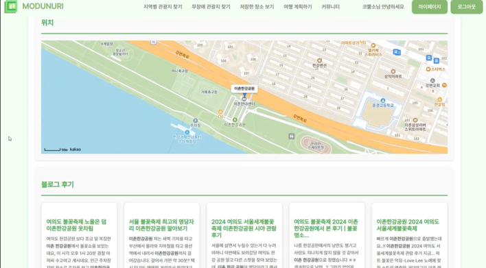
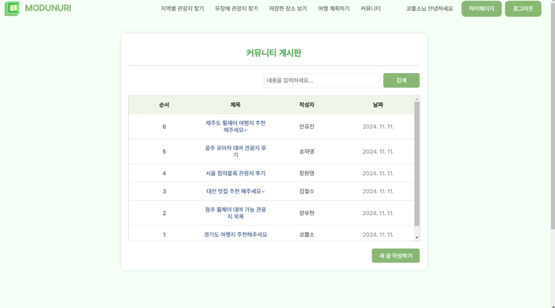
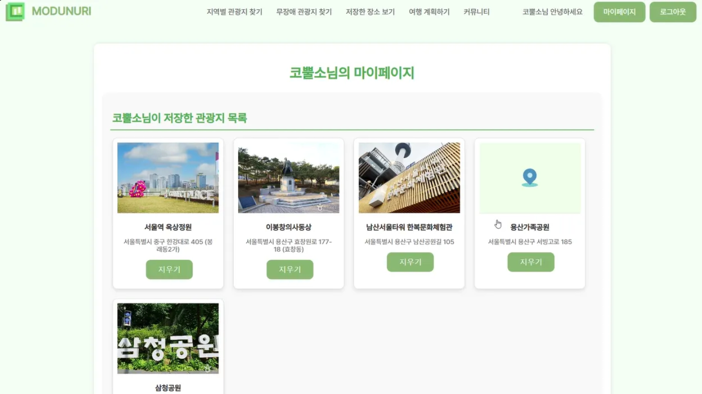

---

# 🖥️  개발 배경

코로나19 팬데믹 이후 여행을 즐기는 사람들이 꾸준히 증가하고 있지만, 장애인, 노약자, 유아 동반자 등 사회적 약자들은 여전히 여행에서 소외되고 있습니다. 많은 관광지가 무장애 환경을 충분히 제공하지 못하고 있으며, 관련 정보 역시 부족해 이동이 불편한 사람들은 여행을 계획하고 실행하는 데 어려움을 겪고 있습니다.

기존의 여행 정보 플랫폼에서는 무장애 여행에 대한 정보가 부족하거나 흩어져 있어, 이를 체계적으로 제공하는 사회적 약자 친화적인 서비스가 필요하다고 판단하였고,  이에 따라 사회적 약자들이 보다 쉽게 여행을 즐길 수 있도록 돕는 무장애 여행정보 웹 어플리케이션 **"모두누리" 를 개발하였습니다.**

---

# 🏆 성과

- **2024 한국관광공사 관광데이터 활용 공모전 장려상**
- **2024 창의적종합설계 경진대회 (한밭대 컨소시엄) 은상**
- **2024 창의적종합설계 경진대회 (한밭대 컨소시엄) 한국공과대학장협의회장상**
- **2024 충북대학교 공학교육혁신센터 스타트업 배틀그라운드  장려상**
- **2024 한·중·일 글로벌 캡스톤 디자인 금상**
- **2024 - 2학기 개신프론티어 성과보고회 우수상 (우수사례 선정)**

---

# 프로젝트 구조

---

# 🙋‍♂️ 담당 역할

- Open API를 이용하여 관광지 데이터 데이터베이스화
- 로그인/ 회원가입 구현 (Session 기반)
- Kakao Map API, Naver Search API활용 기능 구현
- 여행 계획하기 기능 구현
- 관광지 저장 기능

---

# ⚙️ 구현 기능

### 세션 기반 로그인 구현

- **Spring Security**의 폼 로그인 방식을 활용하여 사용자가 입력한 `userId`와 `password`를 검증
- 인증에 성공하면 서버가 `Authentication` 객체를 세션에 저장하고, **JSESSIONID 쿠키**를 발급하여 로그인 상태를 유지
- 이후 클라이언트는 요청마다 JSESSIONID를 함께 전송하여, 서버가 해당 사용자를 식별

### 공공데이터 포털 Open API 활용

- 전국 16000여개의 관광지 정보, 8000여개의 무장애 정보를 데이터베이스에 저장
- DB에 저장된 정보를 바탕으로 사용자는 관광지를 검색
- 무장애 정보(엘리베이터 유뮤, 장애인화장실 유무, 휠체어 대여, 장애인 주차구역 등)를 활용한 관광지 필터링 기능 구현

### 카카오맵 API, Naver Search API 활용

- 카카오맵 API를 통해 지도위에 관광지 위치 정보 제공
- **카카오 Mobility 길찾기 API**를 활용하여 여러개의 관광지를 경유하는 경로 제공
- Naver Search API를 통해 관광지에 대한 최신 블로그 리뷰 제공

### 여행 후기 공유 커뮤니티

- 사용자의 경험에 기반한 후기를 작성하여 다른 사용자와 공유할 수 있는 커뮤니티 기능 제공

### 관심 여행지 저장

- 관심 여행지, 관광 코스를 저장하여 마이페이지에서 확인
